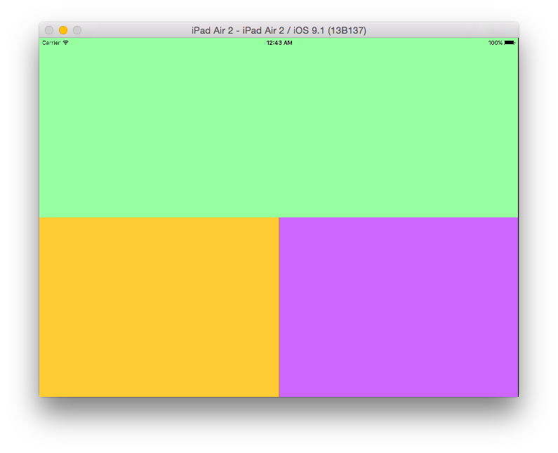
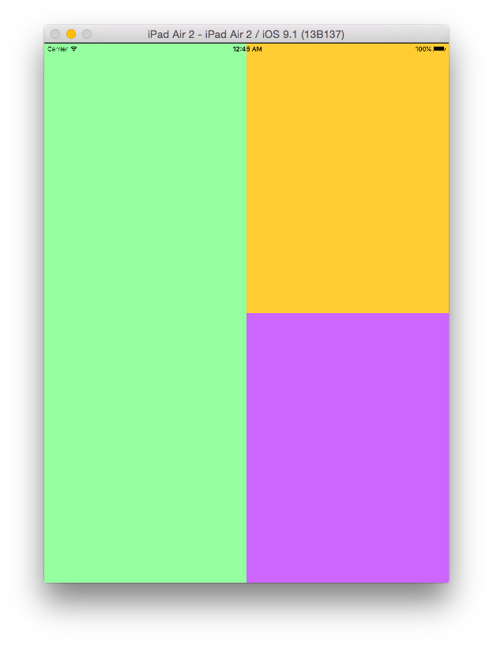

# iPad-Size-Class-Experiment
測試使用 child controller 的方式，來讓 iPad 使用 autolayout size classes

Reference: [Sizing class for iPad portrait and Landscape Modes (StackOverflow)](http://stackoverflow.com/questions/26633172/sizing-class-for-ipad-portrait-and-landscape-modes)

## Screenshot

